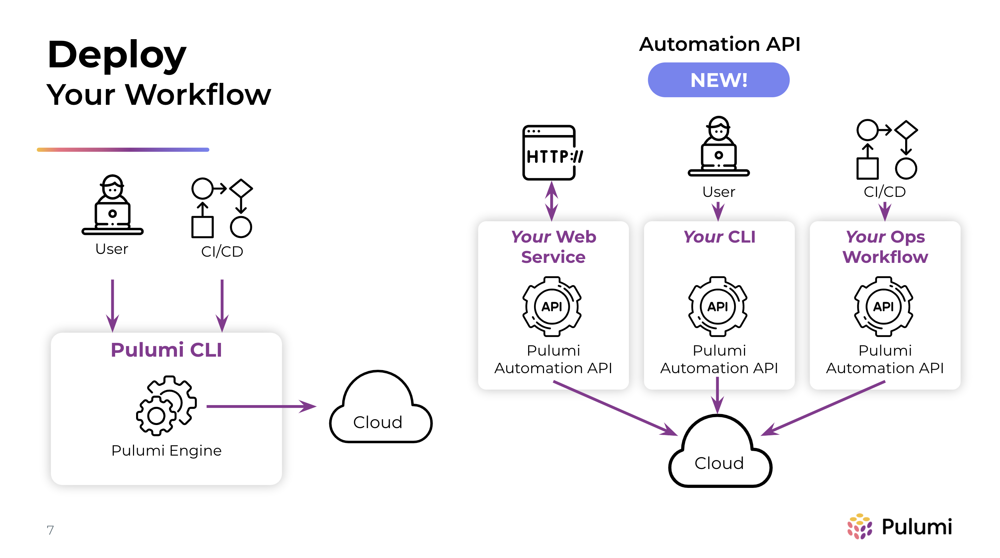

# DevOps

This repository contains DevOps solutions build to explore the technology and to create efficient solutions.
Solutions will be created typically for both on-premise environments and cloud environments.

Creating abstraction layers and reusable code is something that I aim for. As a Full Stack Engineer I am also aiming to build DevOps solutions.
DevOps is a way of creating efficiency and productivity within modern IT environments. DevOps is a term that is used for for the creation and implementation of automated solutions for both Development and Operations.
The abilities to move faster in a stable way is something that organizations implement more often.

My goal is to improve this repository with many solutions while improving my skills and while experiencing different case studies.

## Pulumi

In my road to finding out efficient DevOps tools, I came across a very valuable tool called: "Pulumi".
Pulumi is an advanced tool that gives the possibility to create "universal infrastructure as code" for the core cloud vendors: 'AWS', 'Microsoft Azure' and 'Google Cloud'. 
Writing code for these platforms can be done by using the code a development team is already programming in, such as:'Python', 'C#', 'TypeScript' and more.

The Pulumi engine is an automation api that gives the possibility to deploy resources using multiple methods as shown in the following figure.
